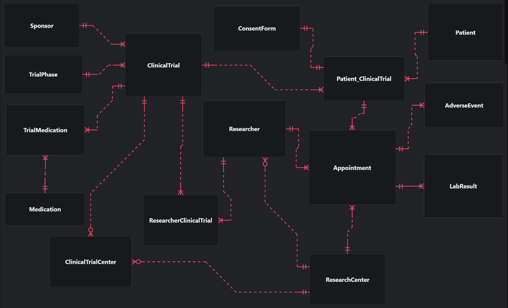

# ClinicalHub Database — Modelo de datos

## Descripción general

Este modelo de base de datos gestiona el ciclo completo de ensayos clínicos: desde los patrocinadores y centros de investigación hasta los pacientes, citas, resultados de laboratorio y eventos adversos.

---

## Diagrama de entidades



---

## Orden real de creación (por niveles de dependencia)

| Nivel | Tablas | Depende de |
|---|---|---|
| 0 | `Sponsor`, `TrialPhase`, `Medication`, `Patient`, `ResearchCenter` | Nada (catálogos base) |
| 1 | `Researcher`, `ClinicalTrial` | Nivel 0 |
| 2 | `Patient_ClinicalTrial`, `ResearcherClinicalTrial`, `ClinicalTrialCenter`, `TrialMedication` *(tablas puente)* | Nivel 1 |
| 3 | `ConsentForm`, `Appointment` | Nivel 2 |
| 4 | `AdverseEvent`, `LabResult` | Nivel 3 (Appointment) |

---

## Tablas

### `Sponsor`
Organización que financia y patrocina el ensayo clínico.

| Columna | Tipo | Restricción | Descripción |
|---------|------|-------------|-------------|
| `id` | int | PK, NOT NULL, Auto Increment | Identificador único |
| `name` | varchar(150) | NOT NULL | Nombre del patrocinador |
| `contact_info` | varchar(100) | | Información de contacto |
| `org_type` | varchar(100) | | Tipo de organización |
| `country` | varchar(100) | | País de origen |

---

### `TrialPhase`
Catálogo de fases clínicas (Fase I, II, III, IV). Relación **muchos a uno** con `ClinicalTrial`: una fase puede aplicar a muchos ensayos, pero cada ensayo tiene una única fase vigente.

| Columna | Tipo | Restricción | Descripción |
|---------|------|-------------|-------------|
| `id` | int | PK, NOT NULL, Auto Increment | Identificador único |
| `phase_number` | int | NOT NULL | Número de fase |
| `name` | varchar(100) | NOT NULL | Nombre de la fase |
| `objective` | varchar(200) | | Objetivo de la fase |

---

### `Medication`
Catálogo general de medicamentos, independiente de cualquier ensayo específico.

| Columna | Tipo | Restricción | Descripción |
|---------|------|-------------|-------------|
| `id` | int | PK, NOT NULL, Auto Increment | Identificador único |
| `name` | varchar(150) | | Nombre del medicamento |
| `activeIngredient` | varchar(150) | | Ingrediente activo |

---

### `Patient`
Paciente registrado en el sistema.

| Columna | Tipo | Restricción | Descripción |
|---------|------|-------------|-------------|
| `id` | int | PK, NOT NULL, Auto Increment | Identificador único |
| `first_name` | varchar(30) | NOT NULL | Nombre |
| `last_name` | varchar(30) | NOT NULL | Apellido |
| `date_birth` | date | NOT NULL | Fecha de nacimiento |
| `gender` | varchar(20) | NOT NULL, CHECK | Género (`Male`, `Female`, `Other`, `Prefer not to say`) |
| `blood_type` | varchar(10) | NOT NULL, CHECK | Tipo de sangre (`A+`, `A-`, `B+`, `B-`, `AB+`, `AB-`, `O+`, `O-`) |
| `contactEmail` | varchar(100) | NOT NULL, UNIQUE | Correo de contacto |

---

### `ResearchCenter`
Centro de investigación donde se ejecuta el ensayo.

| Columna | Tipo | Restricción | Descripción |
|---------|------|-------------|-------------|
| `id` | int | PK, NOT NULL, Auto Increment | Identificador único |
| `name` | varchar(100) | NOT NULL | Nombre del centro |
| `location` | varchar(100) | NOT NULL | Ubicación |
| `facility_type` | varchar(50) | NOT NULL | Tipo de instalación |
| `country` | varchar(100) | | País |
| `contactEmail` | varchar(100) | NOT NULL, UNIQUE | Correo de contacto |

---

### `Researcher`
Investigador o profesional médico. Relación **muchos a uno** con `ResearchCenter`: un centro puede tener varios investigadores, cada investigador pertenece a un solo centro.

| Columna | Tipo | Restricción | Descripción |
|---------|------|-------------|-------------|
| `id` | int | PK, NOT NULL, Auto Increment | Identificador único |
| `ResearchCenter_id` | int | FK → ResearchCenter.id | Centro al que pertenece |
| `first_name` | varchar(30) | NOT NULL | Nombre |
| `last_name` | varchar(30) | NOT NULL | Apellido |
| `specialization` | varchar(50) | NOT NULL | Especialización |
| `email` | varchar(100) | NOT NULL, UNIQUE | Correo electrónico |
| `role` | varchar(50) | | Rol general |

---

### `ClinicalTrial`
Ensayo clínico registrado.

| Columna | Tipo | Restricción | Descripción |
|---------|------|-------------|-------------|
| `id` | int | PK, NOT NULL, Auto Increment | Identificador único |
| `sponsor_id` | int | FK → Sponsor.id | Patrocinador del ensayo |
| `TrialPhase_id` | int | FK → TrialPhase.id | Fase vigente del ensayo |
| `title` | varchar(255) | NOT NULL | Título del ensayo |
| `status` | varchar(50) | NOT NULL, CHECK | `Planned`, `Recruiting`, `Active`, `Suspended`, `Completed`, `Terminated` |
| `description` | varchar(500) | | Descripción |
| `start_date` | date | | Fecha de inicio |
| `end_date` | date | CHECK | Fecha de finalización (debe ser ≥ `start_date` si ambas existen) |

---

### `Patient_ClinicalTrial` *(tabla puente)*
Inscripción de un paciente en un ensayo. Relación **muchos a muchos** entre `Patient` y `ClinicalTrial`.

| Columna | Tipo | Restricción | Descripción |
|---------|------|-------------|-------------|
| `id` | int | PK, NOT NULL, Auto Increment | Identificador único |
| `trial_id` | int | FK → ClinicalTrial.id | Ensayo clínico |
| `patient_id` | int | FK → Patient.id | Paciente inscrito |
| `status` | varchar(50) | NOT NULL, CHECK | `Screening`, `Enrolled`, `Active`, `Withdrawn`, `Completed` |
| `enrollment_date` | date | | Fecha de inscripción |

🔒 `UNIQUE (patient_id, trial_id)` — un paciente no puede inscribirse dos veces en el mismo ensayo.

---

### `ResearcherClinicalTrial` *(tabla puente)*
Asignación de un investigador a un ensayo. Relación **muchos a muchos** entre `Researcher` y `ClinicalTrial`.

| Columna | Tipo | Restricción | Descripción |
|---------|------|-------------|-------------|
| `id` | int | PK, NOT NULL, Auto Increment | Identificador único |
| `researcher_id` | int | FK → Researcher.id | Investigador asignado |
| `clinicalTrial_id` | int | FK → ClinicalTrial.id | Ensayo clínico |
| `roleInTrial` | varchar(50) | NOT NULL | Rol en el ensayo |
| `start_date` | date | CHECK | Fecha de inicio de asignación |
| `end_date` | date | CHECK | Fecha de fin (debe ser ≥ `start_date` si ambas existen) |

🔒 `UNIQUE (researcher_id, clinicalTrial_id)` — un investigador no se repite en el mismo ensayo.

---

### `ClinicalTrialCenter` *(tabla puente)*
Centros donde se ejecuta un ensayo. Relación **muchos a muchos** entre `ClinicalTrial` y `ResearchCenter`.

| Columna | Tipo | Restricción | Descripción |
|---------|------|-------------|-------------|
| `id` | int | PK, NOT NULL, Auto Increment | Identificador único |
| `clinicalTrial_id` | int | FK → ClinicalTrial.id | Ensayo clínico |
| `researchCenter_id` | int | FK → ResearchCenter.id | Centro de investigación |
| `start_date` | date | CHECK | Fecha de inicio |
| `end_date` | date | CHECK | Fecha de fin (debe ser ≥ `start_date` si ambas existen) |
| `status` | varchar(50) | NOT NULL, CHECK | `Active`, `Inactive`, `Closed` |

🔒 `UNIQUE (clinicalTrial_id, researchCenter_id)` — un centro no se vincula dos veces al mismo ensayo.

---

### `TrialMedication` *(tabla puente)*
Medicamentos usados en un ensayo. Relación **muchos a muchos** entre `Medication` y `ClinicalTrial`.

| Columna | Tipo | Restricción | Descripción |
|---------|------|-------------|-------------|
| `id` | int | PK, NOT NULL, Auto Increment | Identificador único |
| `Medication_id` | int | FK → Medication.id | Medicamento utilizado |
| `ClinicalTrial_id` | int | FK → ClinicalTrial.id | Ensayo clínico |
| `frequency` | varchar(50) | | Frecuencia de administración |
| `dosage` | decimal(10,2) | | Dosis |
| `route` | varchar(50) | | Vía de administración |

🔒 `UNIQUE (Medication_id, ClinicalTrial_id)` — un medicamento no se repite dentro del mismo ensayo.

---

### `ConsentForm`
Formulario de consentimiento informado del paciente.

| Columna | Tipo | Restricción | Descripción |
|---------|------|-------------|-------------|
| `id` | int | PK, NOT NULL, Auto Increment | Identificador único |
| `patientClinicalTrial_id` | int | FK → Patient_ClinicalTrial.id | Inscripción del paciente |
| `signedDate` | date | NOT NULL | Fecha de firma |
| `protocolVersion` | varchar(100) | NOT NULL | Versión del protocolo firmado |
| `revokedDate` | date | | Fecha de revocación (si aplica) |

---

### `Appointment`
Visita o cita programada para un paciente dentro de un ensayo.

| Columna | Tipo | Restricción | Descripción |
|---------|------|-------------|-------------|
| `id` | int | PK, NOT NULL, Auto Increment | Identificador único |
| `patientClinicalTrial_id` | int | FK → Patient_ClinicalTrial.id | Inscripción del paciente |
| `researcher_id` | int | FK → Researcher.id | Investigador responsable |
| `researchCenter_id` | int | FK → ResearchCenter.id | Centro donde se realiza |
| `status` | varchar(50) | NOT NULL, CHECK | `Scheduled`, `Completed`, `Cancelled`, `NoShow`, `Rescheduled` |
| `visitNumber` | int | NOT NULL | Número de visita |
| `scheduleDate` | **datetime** | | Fecha y hora programada |
| `attendedDate` | **datetime** | CHECK | Fecha y hora real de asistencia (debe ser ≥ `scheduleDate` si ambas existen) |
| `vital_signs` | varchar(200) | | Signos vitales registrados |
| `clinicalNote` | varchar(500) | | Notas clínicas |

🔒 `UNIQUE (patientClinicalTrial_id, visitNumber)` — no se repite el número de visita para la misma inscripción.

---

### `AdverseEvent`
Evento adverso reportado durante una cita.

| Columna | Tipo | Restricción | Descripción |
|---------|------|-------------|-------------|
| `id` | int | PK, NOT NULL, Auto Increment | Identificador único |
| `appointment_id` | int | FK → Appointment.id | Cita donde se detectó |
| `description` | varchar(200) | | Descripción del evento |
| `severity` | int | CHECK | Nivel de severidad (1 a 5) |
| `onset_date` | date | | Fecha de inicio del evento |

---

### `LabResult`
Resultado de laboratorio vinculado a una cita.

| Columna | Tipo | Restricción | Descripción |
|---------|------|-------------|-------------|
| `id` | int | PK, NOT NULL, Auto Increment | Identificador único |
| `appointment_id` | int | FK → Appointment.id | Cita asociada |
| `test_type` | varchar(50) | | Tipo de prueba |
| `test_Name` | varchar(50) | | Nombre del test |
| `measured_value` | float | | Valor medido |
| `unit` | varchar(10) | | Unidad de medida |
| `referenceMin` | float | | Valor mínimo de referencia |
| `referenceMax` | float | | Valor máximo de referencia |

---

## Relaciones

| Relación | Tipo | Descripción |
|----------|------|-------------|
| Sponsor → ClinicalTrial | 1 : N | Un patrocinador puede financiar varios ensayos |
| TrialPhase → ClinicalTrial | N : 1 | Muchos ensayos pueden compartir la misma fase (catálogo reutilizado) |
| ClinicalTrial → Patient_ClinicalTrial | 1 : N | Un ensayo puede tener múltiples pacientes inscritos |
| Patient → Patient_ClinicalTrial | 1 : N | Un paciente puede inscribirse en varios ensayos |
| ClinicalTrial → ResearcherClinicalTrial | 1 : N | Un ensayo puede tener varios investigadores |
| Researcher → ResearcherClinicalTrial | 1 : N | Un investigador puede participar en varios ensayos |
| ClinicalTrial → ClinicalTrialCenter | 1 : N | Un ensayo puede ejecutarse en varios centros |
| ResearchCenter → ClinicalTrialCenter | 1 : N | Un centro puede albergar varios ensayos |
| ResearchCenter → Researcher | 1 : N | Un centro puede tener varios investigadores |
| Patient_ClinicalTrial → Appointment | 1 : N | Una inscripción genera múltiples citas |
| Researcher → Appointment | 1 : N | Un investigador puede atender múltiples citas |
| ResearchCenter → Appointment | 1 : N | Un centro puede tener múltiples citas |
| Appointment → LabResult | 1 : N | Una cita puede generar varios resultados de laboratorio |
| Appointment → AdverseEvent | 1 : N | Una cita puede reportar varios eventos adversos |
| Patient_ClinicalTrial → ConsentForm | 1 : N | Una inscripción puede tener varios formularios de consentimiento |
| ClinicalTrial → TrialMedication | 1 : N | Un ensayo puede usar varios medicamentos |
| Medication → TrialMedication | 1 : N | Un medicamento puede usarse en varios ensayos |

---

## Restricciones adicionales implementadas

### UNIQUE compuestas (reglas de negocio en tablas puente)
- `Patient_ClinicalTrial (patient_id, trial_id)`
- `ResearcherClinicalTrial (researcher_id, clinicalTrial_id)`
- `ClinicalTrialCenter (clinicalTrial_id, researchCenter_id)`
- `TrialMedication (Medication_id, ClinicalTrial_id)`
- `Appointment (patientClinicalTrial_id, visitNumber)`

### CHECK constraints
- Valores válidos de `status` en `ClinicalTrial`, `Patient_ClinicalTrial`, `ClinicalTrialCenter`, `Appointment`.
- `AdverseEvent.severity` entre 1 y 5.
- `Patient.gender` y `Patient.blood_type` restringidos a valores predefinidos.
- Coherencia de fechas (`start_date <= end_date`, `attendedDate >= scheduleDate`) en `ClinicalTrial`, `ClinicalTrialCenter`, `ResearcherClinicalTrial` y `Appointment`.

### Índices
Se crearon índices sobre **todas** las columnas FK (SQL Server no las indexa automáticamente), para optimizar los JOINs entre las 16 tablas.

---

## Flujo general del sistema

```
1. Sponsor registra un ClinicalTrial, asignado a una TrialPhase
2. ClinicalTrial se vincula a centros (ClinicalTrialCenter) e investigadores (ResearcherClinicalTrial)
3. Medications se vinculan al ensayo (TrialMedication)
4. Patient se inscribe → Patient_ClinicalTrial → ConsentForm firmado
5. Se crean Appointments para cada visita (con researcher y researchCenter asignados)
6. En cada Appointment se registran:
   - LabResult (resultados de laboratorio)
   - AdverseEvent (eventos adversos)
```